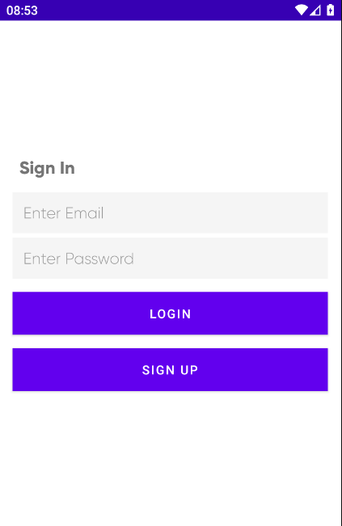
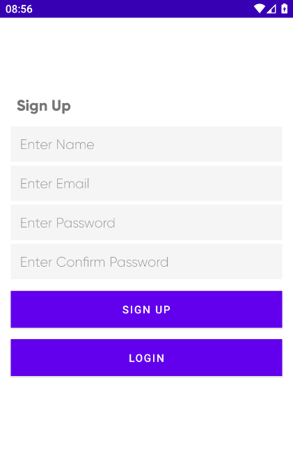

# FirebaseChat
Chat simples utilizando Firebase e Retrofit API 
Firebase Chat, aplicação Android, chat de mensagens entre usuários cadastrados no sistema.

Tecnologias:
<ul>
  <li>Android Studio</li>
  <li>Kotlin</li>
  <li>Firebase</li>
  <li>Retrofit API </li>
  <li>Coroutines</li>
  <li>Glide</li>

</ul>

 

Screenshots:

 

<figure>
	
	<figcaption>Tela de login </figcaption>
</figure>

 

 

<figure>
	
	<figcaption>Tela de cadrastro </figcaption>
</figure>
  
